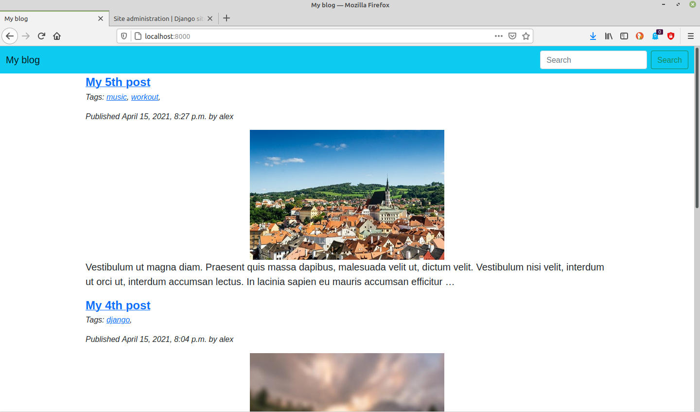

# blog_site_django

The blog website is made by Django 3 

## Description

Have done:
- dividing list of posts to shorter lists on separate pages
- tune up django admin
- adding and show comments for posts
- tags for posts and filter posts by tags
- create dеsign by bootstrap 5
- RSS feed
- Markdown's makeup for posts by way of own filter
- Connection to PostgreSQL

## Installation for Linux*:

1. Clone the repository (or download the zip file and extract it):

    $ `git clone git@github.com:maninserg/blog_site_django.git`
    
2. Go to the directory of the program:
   
    $ `cd <your name of directory>`

2. Create of a virtual environment:

    $ `python3 -m venv .venv`
    
3. Activate the virtual environment:

    $ `source .venv/bin/activate`

3. Install necessary packages using pip according to the requirements.txt file from a directory with the program:

    (.venv) $ `pip install -r requirements.txt`

<i>*The installation for MacOS or Windows can be other</i>

## Screenshots

  

<b>Home page</b>

  

<b>Adding comments</b>

  

<b>Settings of admin</b>

